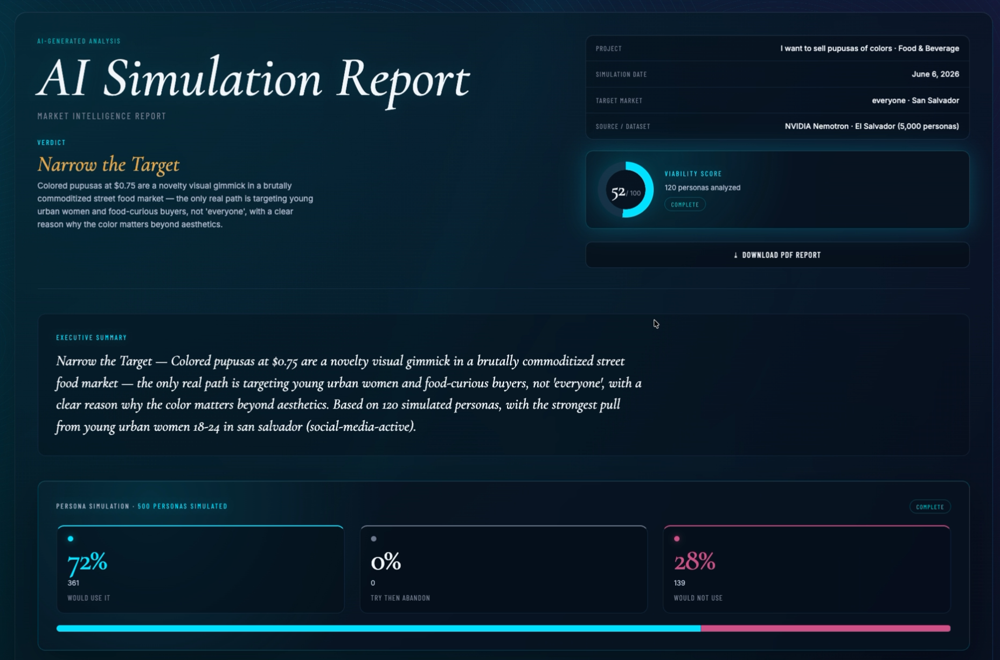

# SV Market Simulator

AI-powered market validation simulator for early-stage startup ideas in El Salvador.

This prototype uses the public **NVIDIA Nemotron-Personas-El-Salvador** synthetic persona dataset and Claude to test startup ideas against simulated local personas. It returns target segments, objections, pricing signals, adoption risks, and a concrete validation plan.

Built during the **CUBO AI Claude Bootcamp** as an experiment in using public datasets for local startup research.

> **Important:** Synthetic personas are not proof of real market demand.
> This tool is designed for early hypothesis testing, not final business validation.

---

## What it does

SV Market Simulator helps founders test an idea before spending time or money on weak assumptions.

Given a startup idea, the simulator analyzes synthetic Salvadoran personas and generates:

* Best target segments
* Worst-fit segments
* Market objections
* Pricing signals
* Adoption risks
* Channel recommendations
* Validation experiments
* AI-generated market report

Example use case:

> “I want to sell colored pupusas in San Salvador.”


The simulator evaluates which persona groups might respond, what objections they may have, what price signals appear, and what should be tested next in the real market.

---


## Why this matters

Most early-stage founders say their product is “for everyone.”

That usually means the target is unclear.

This simulator helps narrow the market by using local synthetic personas to expose:

* Who is more likely to care
* Who is unlikely to adopt
* What objections appear repeatedly
* What pricing assumptions may be risky
* What should be tested with real customers next

---

## How it works

1. Load the Nemotron-Personas-El-Salvador dataset.
2. Enter a startup idea.
3. The system samples and analyzes synthetic personas.
4. Claude generates a structured market simulation report.
5. The output includes segments, objections, pricing signals, and next validation steps.

---

## Limitations

This project does **not** replace:

* Real customer interviews
* Field research
* Sales conversations
* Real purchase behavior
* Market experiments

Synthetic personas are useful for generating hypotheses, but real demand must be validated with real people.

Use this as a first-pass thinking tool, not as a final decision engine.

---

## Tech Stack

* Node.js
* Express
* Claude / Anthropic API
* NVIDIA Nemotron-Personas-El-Salvador dataset
* Local dataset cache
* HTML/CSS/JavaScript frontend

---

## Setup

```bash
cd ~/Desktop/sv-market-simulator
npm install
```

Create a `.env` file:

```env
ANTHROPIC_API_KEY=sk-ant-your-key-here
PORT=3001
```

> Never commit your real API key to GitHub.

---

## Run

```bash
npm start
```

Open:

```text
http://localhost:3001
```

---

## Load Dataset

### Quick load

Loads 5,000 personas in progressive mode.

```text
Click "Load Dataset" in the UI.
```

Default behavior:

```text
progressive mode
100 rows per batch
~30 seconds
```

---

### Larger load via API

```bash
curl -X POST http://localhost:3001/api/dataset/load \
  -H "Content-Type: application/json" \
  -d '{"mode":"progressive","batchSize":100,"maxRows":20000}'
```

---

### Full dataset

The full dataset is much larger and may take a long time.

```bash
curl -X POST http://localhost:3001/api/dataset/load \
  -H "Content-Type: application/json" \
  -d '{"mode":"full","batchSize":100,"maxRows":148000}'
```

Interrupted loads resume from the last offset. Partial caches are preserved.

---

## Check Dataset Status

```bash
curl http://localhost:3001/api/dataset/status
```

---

---

## Disclaimer

This is an experimental prototype. The analysis is generated from synthetic personas and AI reasoning. It should be used to support early thinking, not to make final investment, product, or market decisions.
